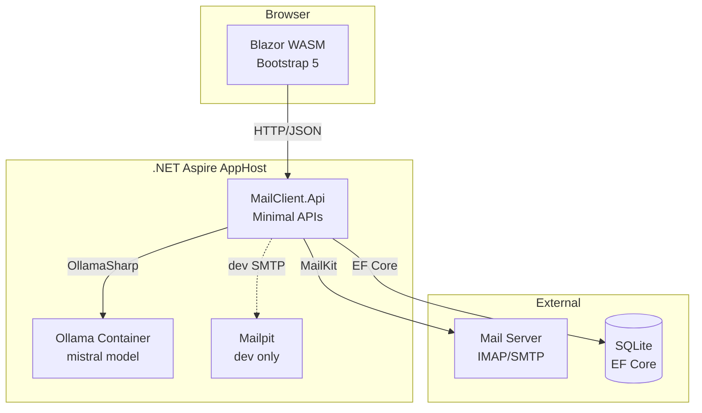

# MailClient — Architecture & Design

## Goals

- Provide a self-hosted mail client optimized for NAS systems
- Deliver a modern, responsive web UI for managing email
- Integrate local LLM capabilities for smart mail features
- Keep deployment simple: single command via Aspire, minimal external dependencies
- Support multiple mail accounts with IMAP/SMTP

## Non-Goals

- Not a replacement for Gmail/Outlook at scale — designed for personal/small team use
- No mobile-native apps (responsive web UI covers mobile use)
- No built-in mail server — connects to existing IMAP/SMTP servers
- No calendar or contacts integration (initial scope)

## System Architecture

## Component Descriptions

### MailClient.AppHost

The .NET Aspire orchestration project and the main entry point for development.

**Responsibilities:**
- Registers and configures all services (API, Web, Ollama, Mailpit)
- Manages service discovery and connection strings
- Provides the Aspire dashboard for monitoring
- Configures Ollama container via `CommunityToolkit.Aspire.Hosting.Ollama`

**Key configuration:**
- Ollama with `mistral` model and persistent data volume
- Mailpit for development mail testing
- Service references between API and Ollama

### MailClient.ServiceDefaults

Shared service configuration applied to all projects.

**Provides:**
- OpenTelemetry setup (distributed tracing and metrics)
- Default health checks (`/health`, `/alive`)
- HTTP client resilience policies (via Polly)
- Service discovery configuration

### MailClient.Api

ASP.NET Core Minimal API backend. The central hub connecting the frontend to mail servers, LLM, and database.

**Endpoint groups:**
- `MailEndpoints` — `/api/mail/*` — List, read, send, delete, move messages
- `FolderEndpoints` — `/api/folders/*` — List and manage mail folders
- `SettingsEndpoints` — `/api/settings/*` — Account and application settings
- `AiEndpoints` — `/api/ai/*` — Summarize, draft reply, categorize

**Key services:**
- `IMailService` / `MailService` — MailKit-based IMAP/SMTP operations
- `IAiService` / `AiService` — OllamaSharp-based LLM interactions
- `IMailAccountService` / `MailAccountService` — Account credential management
- `MailClientDbContext` — EF Core context for SQLite

### MailClient.Web

Blazor WebAssembly standalone application. Runs entirely in the browser.

**Key components:**
- `MailList` — Paginated message list with search and filter
- `MailView` — Full message display with HTML rendering
- `ComposeDialog` — Rich text mail composition
- `FolderTree` — Hierarchical folder navigation
- `AiSidebar` — AI feature panel (summary, reply draft, categories)
- `SettingsPage` — Account and app configuration
- `AccountSetup` — Mail account onboarding wizard

**Communication:** All server interaction via typed `HttpClient` services calling the API.

### MailClient.Shared

Shared library referenced by both API and Web projects.

**Contains:**
- DTOs (record types): `MailMessageDto`, `MailListItemDto`, `FolderDto`, `ComposeMailDto`, `AiSummaryRequestDto`, `AiSummaryResponseDto`, `AiDraftReplyRequestDto`, `AiCategorizeResponseDto`
- Interfaces: `IMailApiClient`, `IAiApiClient`
- Enums: `MailPriority`, `AiFeatureType`
- Constants: `ApiRoutes`

## API Endpoints

### Mail — `/api/mail`

| Method | Path | Description |
|--------|------|-------------|
| GET | `/api/mail?folder={name}&page={n}&size={n}` | List messages in folder |
| GET | `/api/mail/{id}` | Get full message |
| POST | `/api/mail` | Send a new message |
| POST | `/api/mail/{id}/reply` | Reply to a message |
| POST | `/api/mail/{id}/forward` | Forward a message |
| DELETE | `/api/mail/{id}` | Delete message |
| PATCH | `/api/mail/{id}/read` | Mark as read/unread |
| PATCH | `/api/mail/{id}/move` | Move to folder |

### Folders — `/api/folders`

| Method | Path | Description |
|--------|------|-------------|
| GET | `/api/folders` | List all folders with unread counts |
| POST | `/api/folders` | Create folder |
| DELETE | `/api/folders/{name}` | Delete folder |

### Settings — `/api/settings`

| Method | Path | Description |
|--------|------|-------------|
| GET | `/api/settings/accounts` | List configured mail accounts |
| POST | `/api/settings/accounts` | Add mail account |
| PUT | `/api/settings/accounts/{id}` | Update mail account |
| DELETE | `/api/settings/accounts/{id}` | Remove mail account |
| POST | `/api/settings/accounts/{id}/test` | Test account connection |
| GET | `/api/settings/preferences` | Get user preferences |
| PUT | `/api/settings/preferences` | Update user preferences |

### AI — `/api/ai`

| Method | Path | Description |
|--------|------|-------------|
| POST | `/api/ai/summarize` | Summarize a mail message |
| POST | `/api/ai/draft-reply` | Generate a reply draft |
| POST | `/api/ai/categorize` | Categorize messages |

## Data Model

### CachedMessage

Local cache of messages retrieved via IMAP. Reduces IMAP round-trips for listing and search.

| Field | Type | Description |
|-------|------|-------------|
| Id | int (PK) | Auto-increment ID |
| MessageId | string | RFC Message-ID header |
| AccountId | int (FK) | Associated mail account |
| Subject | string | Message subject |
| From | string | Sender address |
| To | string | Recipient addresses (JSON array) |
| Cc | string? | CC addresses (JSON array) |
| Date | DateTimeOffset | Message date |
| BodyPreview | string | First ~200 chars of body text |
| FolderName | string | IMAP folder name |
| IsRead | bool | Read status |
| HasAttachments | bool | Attachment indicator |
| Flags | string? | IMAP flags (JSON array) |
| LastSyncedAt | DateTimeOffset | When this cache entry was last updated |

### MailAccount

Mail server credentials and configuration.

| Field | Type | Description |
|-------|------|-------------|
| Id | int (PK) | Auto-increment ID |
| DisplayName | string | User-friendly name |
| EmailAddress | string | Email address |
| ImapHost | string | IMAP server hostname |
| ImapPort | int | IMAP port (default: 993) |
| SmtpHost | string | SMTP server hostname |
| SmtpPort | int | SMTP port (default: 587) |
| Username | string | Login username |
| EncryptedPassword | string | AES-encrypted password |
| UseSsl | bool | Use SSL/TLS |
| IsDefault | bool | Default account flag |

### UserSettings

Application-level user preferences.

| Field | Type | Description |
|-------|------|-------------|
| Id | int (PK) | Auto-increment ID |
| Theme | string | UI theme (light/dark/auto) |
| DefaultAccountId | int? (FK) | Default mail account |
| AiEnabled | bool | Enable/disable AI features |
| PreviewLineCount | int | Lines shown in mail list preview |
| PageSize | int | Messages per page |

## Security Considerations

- **Credential Storage:** Mail passwords encrypted with AES using a machine-derived key. Never stored in plain text.
- **No Credential Exposure:** Passwords excluded from API responses and Aspire dashboard environment variables.
- **CORS:** Restricted to the Blazor WASM origin only.
- **Rate Limiting:** AI endpoints rate-limited to prevent resource exhaustion on NAS hardware.
- **Input Validation:** All API inputs validated at the boundary. HTML mail content sanitized before rendering.
- **No External Calls:** AI runs locally via Ollama — no data leaves the NAS (except mail server communication).

## Technology Decisions

| Decision | Rationale |
|----------|-----------|
| **.NET Aspire** | Orchestrates multi-service topology, provides service discovery, dev dashboard, health monitoring out of the box |
| **Blazor WASM** | .NET end-to-end — shared types between frontend and backend, no JavaScript framework needed, offline potential |
| **Minimal APIs** | Lightweight, less ceremony than controllers, ideal for the small-to-medium API surface of a mail client |
| **SQLite** | Single-file database, no server process needed, ideal for NAS deployment, sufficient for personal mail volumes |
| **MailKit/MimeKit** | The gold standard for .NET mail — robust IMAP/SMTP support, proper MIME handling, actively maintained |
| **OllamaSharp** | Typed .NET client for Ollama, supports streaming, model management, integrates cleanly with DI |
| **Bootstrap 5** | Proven, responsive, large component ecosystem, works with CDN or static files — no build toolchain required |

## Future: Google Stitch / MCP Integration

*Details to be provided.* Planned integration with Google Stitch via Model Context Protocol (MCP) for enhanced AI capabilities. A `Stitch2Blazor` skill will be created for generating Blazor components from designs.
